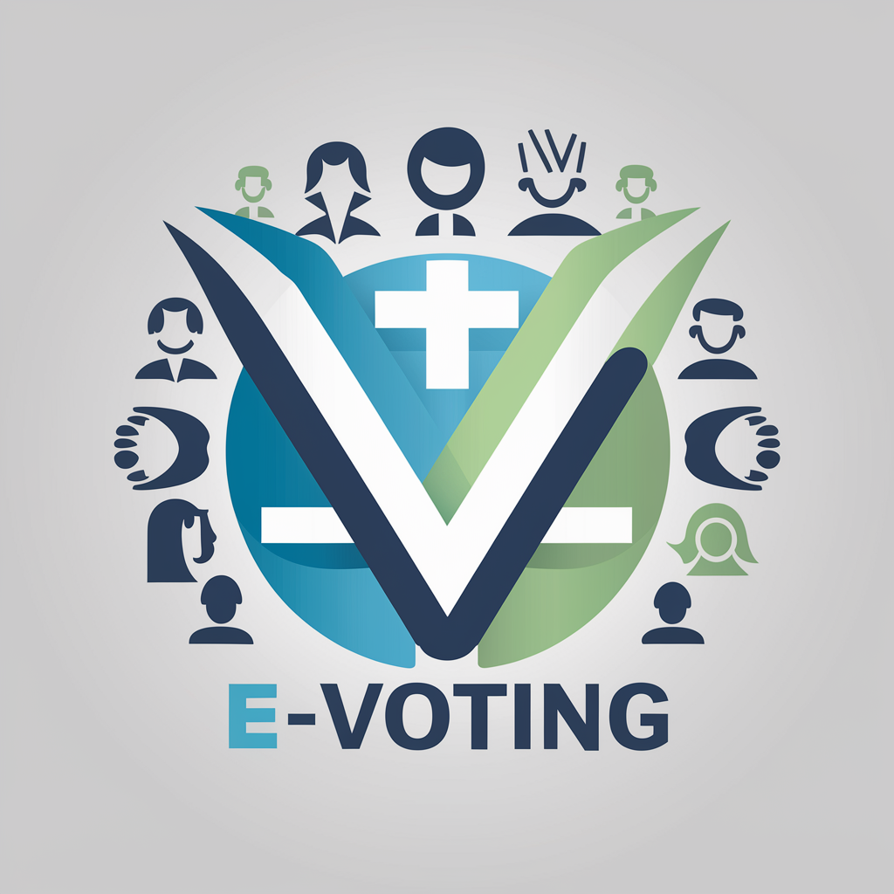
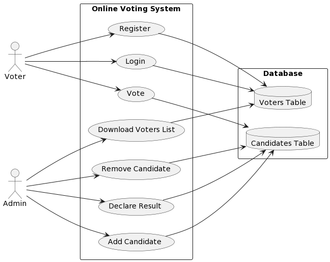
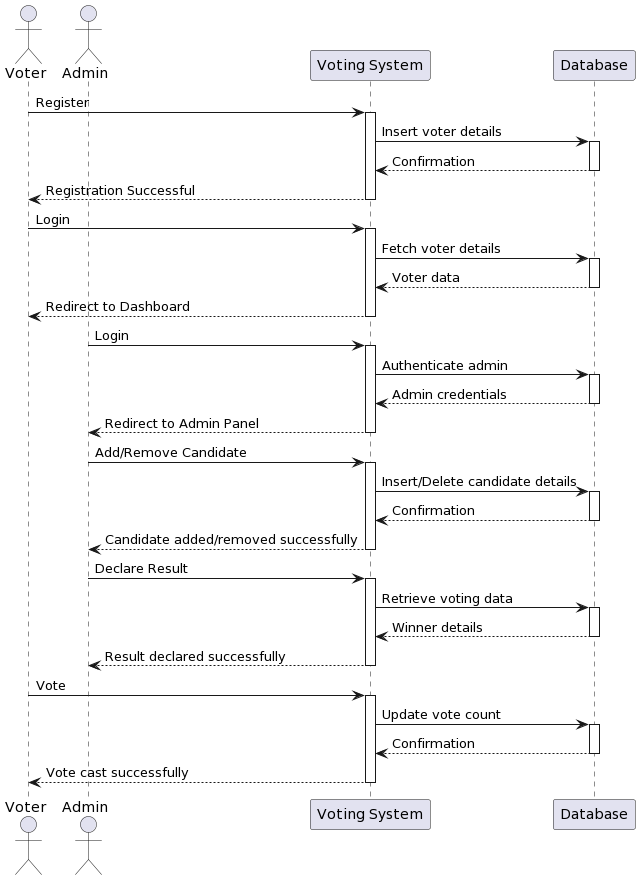
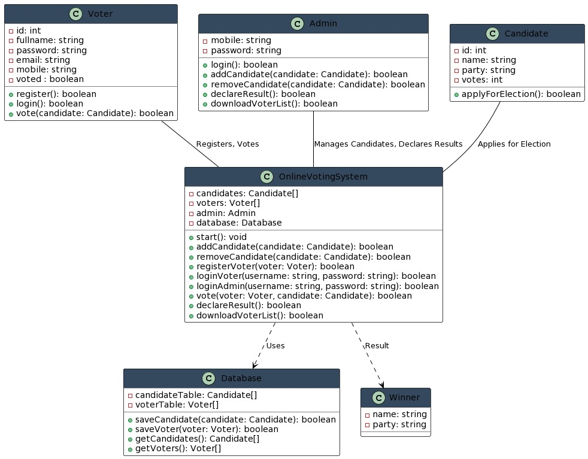

  

# Online Voting System

## Description

The Online Voting System is a web-based application designed to facilitate the voting process in various elections, including governmental, organizational, or academic elections. This system provides a convenient and efficient platform for voters to cast their votes remotely from any location with internet access.

## Tech Stack Used

### Frontend
- HTML: Markup language for structuring web pages.
- CSS: Styling language for designing the appearance of web pages.
- JavaScript: Programming language for implementing client-side interactivity and dynamic behavior.

### Backend
- PHP: Server-side scripting language for handling server-side logic and generating dynamic web content.

### Database
- MySQL: Relational database management system (RDBMS) for storing and managing data related to users, candidates, and votes.

## Code

The code for this project is available in the [repository](https://github.com/Rohit27305/E-Voting).

## Deployment

The project is deployed at the following URL:
- https://voteforchangevoteforprogress.000webhostapp.com/

## Presentation

You can view the project presentation slides in the following format:
- [PowerPoint Presentation](E_voting.pptx)

## Functionality

1. **User Authentication**:
   - Frontend: HTML forms for user login and registration.
   - Backend: PHP scripts for processing login and registration requests, validating user credentials, and interacting with the database to authenticate users.

2. **Voter Registration**:
   - Frontend: HTML forms for capturing user registration details.
   - Backend: PHP scripts for handling registration requests, validating input data, and inserting user records into the MySQL database.

3. **Candidate Management**:
   - Frontend: Admin dashboard interface for managing candidates.
   - Backend: PHP scripts for adding, updating, and deleting candidate records in the MySQL database based on administrator actions.

4. **Voting Process**:
   - Frontend: Voter dashboard interface for viewing candidate lists and casting votes.
   - Backend: PHP scripts for processing vote submissions, ensuring vote integrity, and updating vote counts in the MySQL database.

5. **Results and Reports**:
   - Backend: PHP scripts for generating election results and statistics by querying the MySQL database. This data can be presented in various formats, such as tables or charts, for administrators to analyze and generate reports.

## UML Diagram

1. **Use Case Diagram**:
   
   
3. **Sequence Diagram**:
   
   
5. **Class Diagram**:
   
   

## Project Preview

